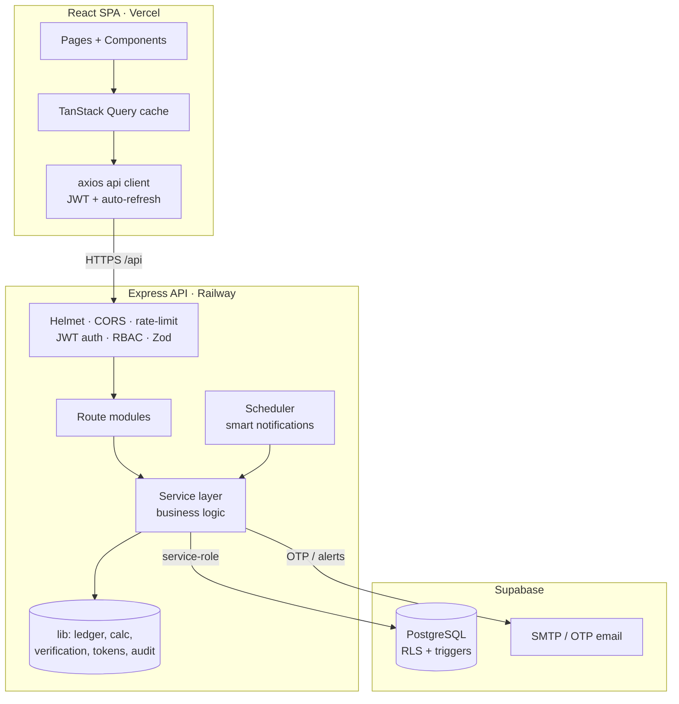

# System Architecture

Antariksha is a modular three-tier application: a React SPA, an Express REST API,
and Supabase PostgreSQL.

## Modules (independent, reusable)

| Module | Routes | Service / lib |
|--------|--------|---------------|
| Authentication | `auth.routes` | `auth.service`, `lib/tokens` |
| User Management | `users.routes` | inline + `lib/audit` |
| Ticket Management | `tickets.routes` | `tickets.service` |
| Verification Engine | `tickets.routes` | `lib/verification` |
| Commission Engine | — | `lib/calc` |
| Financial Management | `payments.routes`, `ledger.routes` | `payments.service`, `lib/ledger` |
| Refund Engine | `refunds.routes` | `refunds.service`, `lib/calc` |
| Replacement / Original | `registers.routes` | inline |
| Analytics | `analytics.routes` | `analytics.service` |
| Reports | `reports.routes` | `reports.service` |
| Notifications | `notifications.routes` | `lib/audit`, `jobs/notifications.job` |
| Audit Logs | `audit.routes` | `lib/audit` |
| Settings | `settings.routes` | inline |
| Calendar | `calendar.routes` | `calendar.service` |
| AI Assistant + Intel | `intel.routes` | `assistant.service`, `reporting.service` |

## Request lifecycle

1. SPA attaches `Authorization: Bearer <access>` (auto-refresh on 401).
2. Express runs Helmet → CORS allow-list → rate limit → JSON parse.
3. Route middleware: `requireAuth` (verify JWT) → `requireRole` (RBAC).
4. Zod validates the body/query.
5. Service executes business logic via the Supabase **service-role** client.
6. Financial events append to the **immutable ledger**; sensitive actions append
   to **audit_logs**. Neither can be updated/deleted (DB trigger on the ledger).

## Security layers

Password hashing (bcrypt) · JWT access/refresh · admin 2FA (email OTP + optional
TOTP) · optional member email-2FA · account lockout · login-attempt logging +
alert emails · idle session timeout · rate limiting · RBAC · RLS policies ·
append-only audit + ledger.

See [ER_DIAGRAM.md](ER_DIAGRAM.md) for the data model and [API.md](API.md) for endpoints.
