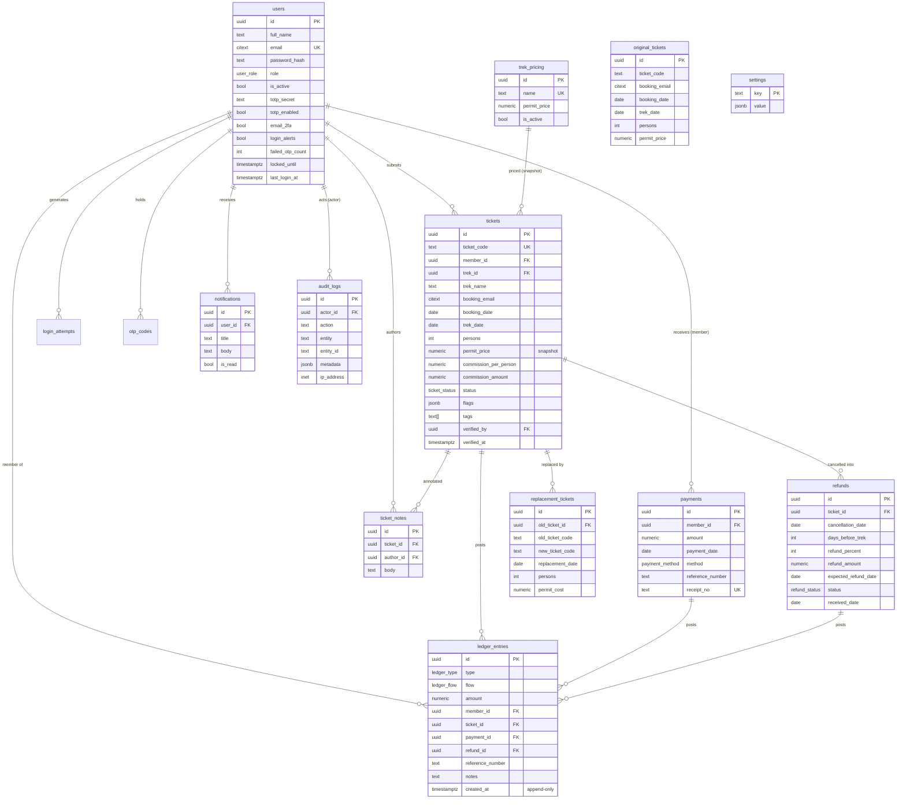

# Entity-Relationship Diagram

**Key invariants**
- `tickets.permit_price` is a **snapshot** — editing `trek_pricing` never mutates history.
- `ledger_entries` and `audit_logs` are **append-only** (the ledger enforces this with a DB trigger).
- `commission_amount` is kept consistent by a DB trigger (`persons × commission_per_person`).
